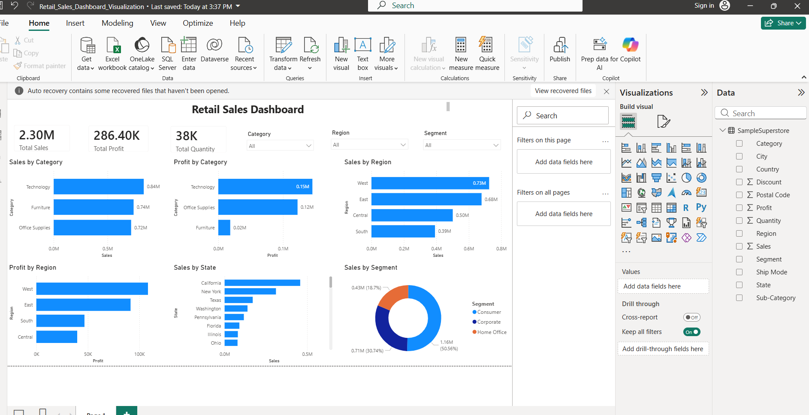

# 📊 Retail Sales Dashboard | Power BI + Python EDA

## 📌 Project Overview
This project is a Retail Sales Data Analysis and Visualization Dashboard built using Python (Jupyter Notebook) and Power BI Desktop.
The goal of this project is to analyze retail business data and extract meaningful insights related to sales, profit, discount impact, regional performance, category trends, and customer segments.
It includes both:
📓 Exploratory Data Analysis (EDA) using Python
📊 Interactive Dashboard using Power BI

## 🎯 Objective
The main objectives of this project are:
-Analyze overall sales and profit performance
-Identify top performing categories, regions, and states
-Understand relationship between discount and profit
-Track performance across customer segments
-Build an interactive dashboard for business decision-making

## 🧰 Tools & Technologies Used
-Python (Pandas, NumPy, Matplotlib, Seaborn)
-Jupyter Notebook
-Power BI Desktop
-Data Visualization Techniques
-Exploratory Data Analysis (EDA)

## 📁 Dataset Description
The dataset contains retail transaction data including:
-Order details
-Sales
-Profit
-Quantity
-Discount
-Category (Technology, Furniture, Office Supplies)
-Sub-Category
-Region (West, East, Central, South)
-State
-Segment (Consumer, Corporate, Home Office)

## 🔄 Project Workflow
### 1. Data Understanding
-Loaded dataset in Jupyter Notebook
-Checked structure using df.head() and df.columns
-Understood data types and relationships
### 2. Data Cleaning
-Handled missing values
-Checked duplicates
-Ensured correct data types for analysis
### 3. Exploratory Data Analysis (EDA)
#### 📊 Analysis performed:
-Sales by Category
-Profit by Category
-Sales by Region
-Profit by Region
-Sales by Segment
-Sales by State
-Top 10 States by Profit
-Discount vs Profit Analysis
-Sales Distribution
-Profit Distribution
-Correlation Heatmap
### 4. Key Visual Insights (Python)
-Identified top performing category: Technology
-Found strong sales contribution from West region
-Observed that high discount often reduces profit
-Certain states contribute significantly to overall revenue
### 5. Power BI Dashboard
The interactive dashboard includes:
- #### 📌 KPI Cards:
Total Sales
Total Profit
Total Quantity
- #### 📊 Visualizations:
Sales by Category
Profit by Category
Sales by Region
Profit by Region
Sales by State
Sales by Segment
- #### 🎛️ Interactive Filters (Slicers):
Category
Region
Segment
- #### 📈 Key Insights
Technology is the most profitable category
West region shows the highest sales performance
California and New York are top contributing states
Discounts negatively affect profit in many cases
Consumer segment drives majority of sales
- #### 📊 Dashboard Preview
👉 

  

## 🚀 How to Run This Project

-Clone the repository

-Open Jupyter Notebook and run EDA steps

-Open .pbix file in Power BI Desktop

-Explore dashboard using slicers and filters

## 📌 Conclusion
This project demonstrates how raw retail data can be transformed into meaningful business insights using data analysis and visualization techniques.
It helps businesses understand:

-What sells the most

-Where profit is generated

-How discounts impact business

-Which regions need improvement

## 👩‍💻 Author
Gaurvi Miglani
Aspiring Data Analyst
Skills: Python | SQL | Power BI | Data Visualization | EDA

## 🔖 Tags
`Data Analytics` `Power BI` `Python` `EDA` `Business Intelligence` `Dashboard` `Data Visualization` `Pandas` `Seaborn`
